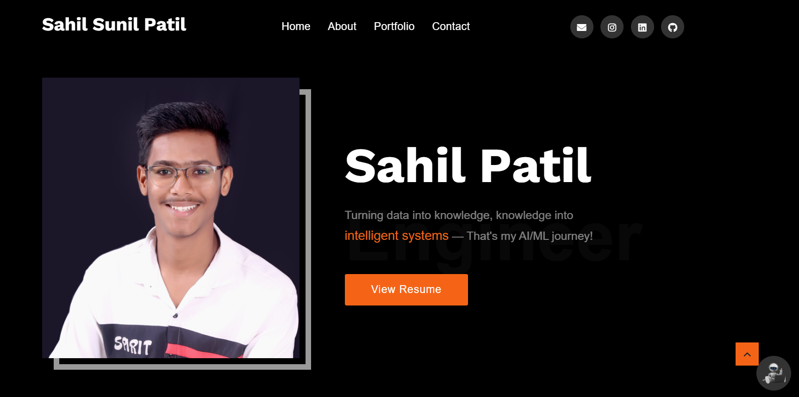

# Portfolio Website

   

A modern, responsive portfolio website that showcases my projects, skills, and experiences. This project is built using HTML, CSS, and JavaScript and is hosted on GitHub Pages. It features smooth animations, an interactive project gallery, a working contact form powered by AJAX, and even a built-in chatbot for quick queries.

## Features

- **Responsive Design:** Optimized for desktops, tablets, and mobile devices.
- **Smooth Animations:** Integrated AOS and slick animations for a modern user experience.
- **Interactive Project Gallery:** Displays projects using Owl Carousel for a dynamic showcase.
- **Contact Form:** AJAX-powered form for easy communication.
- **Chatbot Integration:** A built-in chatbot provides instant responses to common queries.

## Installation

### Prerequisites

- **A Modern Web Browser:** (Chrome, Firefox, Edge, etc.)
- **Internet Connection:** To load external libraries and fonts.
- **Git (Optional):** For cloning the repository.

## Contributing
### Contributions are welcome! To contribute:
### Fork the Repository.
- Create a New Branch (e.g., `git checkout -b feature/your-feature`).
- Commit Your Changes with clear, descriptive messages.
- Push to Your Branch and create a pull request detailing your modifications.
- Please adhere to the project’s coding standards and include tests where applicable.

## License
### This project is licensed under the MIT License. See the LICENSE file for more details.

## Acknowledgements
- **HTML5/CSS3:** For providing a robust foundation for modern web development.
- **JavaScript & jQuery:** For enabling dynamic and interactive features.
- **Owl Carousel & Slick Slider:** For responsive carousels and project galleries.
- **AOS (Animate On Scroll):** For smooth scroll-based animations.
- **The Open-Source Community:** For continuous contributions and support.

# Contact
### For questions, suggestions, or support, please contact:

- **Sahil Sunil Patil**
- **Email: sahilpatil.2422@gmail.com**
- **GitHub: [SahilPatil-codes](https://github.com/SahilPatil-codes)**
